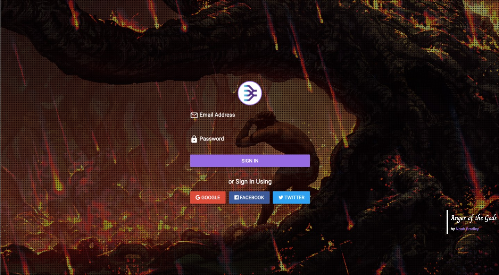
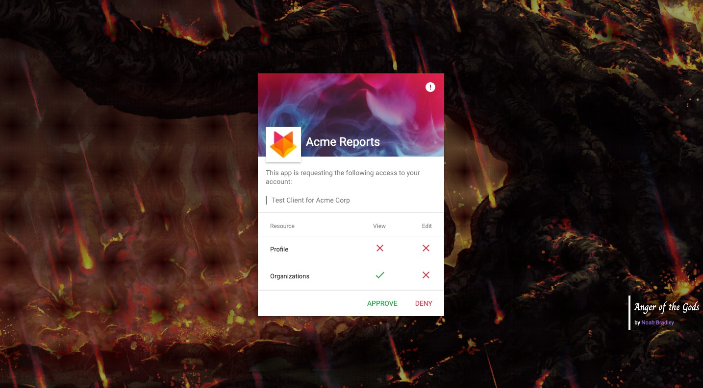

# Getting Started

## Registering your Application

The _mtgbracket_ API is authenticated using the [OAuth 2.0 protocol](https://oauth.net/2/).  The first step is to register your application under Account-&gt;Apps and the clicking the "Register App" button.

After providing the required information and registering your application, you will be provided with a `client_id` and a `client_secret` which will be used to generate API tokens to access your user's data via _mtgbracket_.


As a rule, your application should only request permissions it will need.  These can be changed at any time, but will invalidate any tokens your application has been issued. Your users will need to sign-in again.


## Testing the Authentication Workflow

You can demo your application's sign-in screen by clicking the provided link.  It should look something like this:

Users looking to work with your application should be directed to this URL from your service in order to authenticate.  After the user authenticates with _mtgbracket_, they will automatically be redirected to the `redirect_url` you registered with your app above.

That redirection to your service will include necessary identifiers in order for you to generate an save an API token to your system for the user, which you will use to make API requests on their behalf.

Upon authenticating, your user will be presented with a dialog to review the details of your application and which permissions it will have access to.

In the next section, you will learn about the process for generating API tokens for your users, which are used to authenticate with the _mtgbracket_ API.

